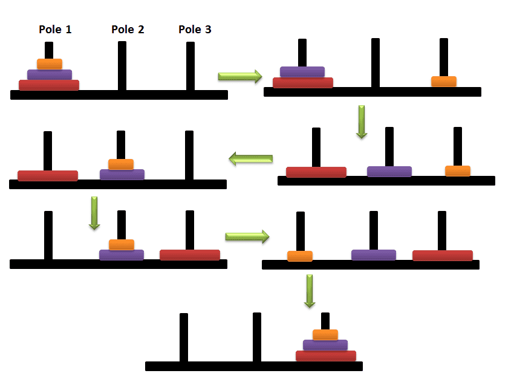

# The Tower of Hanoi Problem 

## 1. The game:

Very simple implementation of the game. There are:
 - Three stacking rods.
 - A Tower made of decrasing size disks in the left stack.

The objective is to transport the tower from the left stack to the right stack, only transporting 1 disk at a time and **NEVER** placing a disk on top of larger a smaller one.



From: [C Program for Tower of Hanoi](http://elgoacademy.org/c-program-for-tower-of-hanoi/)

## 2. Implementation:

The number of disks is set as user input.

Setting up:

```sh
$ git clone <repo>
$ mkdir build bin
$ cd build/
$ cmake ../
$ make
```

Playing:

```sh
$ ./../bin/Tower_of_Hanoi

TOWER OF HANOI

       >> Enter the number of disks you want to play: 3

Sequence of movements:

TOWER OF HANOI

       >> Enter the number of disks you want to play: 4

Sequence of movements:

Move disk 1 from stack LEFT to stack MIDDLE
Move disk 2 from stack LEFT to stack RIGHT
Move disk 1 from stack MIDDLE to stack RIGHT
Move disk 3 from stack LEFT to stack MIDDLE
Move disk 1 from stack RIGHT to stack LEFT
Move disk 2 from stack RIGHT to stack MIDDLE
Move disk 1 from stack LEFT to stack MIDDLE
Move disk 4 from stack LEFT to stack RIGHT
Move disk 1 from stack MIDDLE to stack RIGHT
Move disk 2 from stack MIDDLE to stack LEFT
Move disk 1 from stack RIGHT to stack LEFT
Move disk 3 from stack MIDDLE to stack RIGHT
Move disk 1 from stack LEFT to stack MIDDLE
Move disk 2 from stack LEFT to stack RIGHT
Move disk 1 from stack MIDDLE to stack RIGHT

Total number of steps: 15.
Calculated in 5.8e-05 seconds.
```